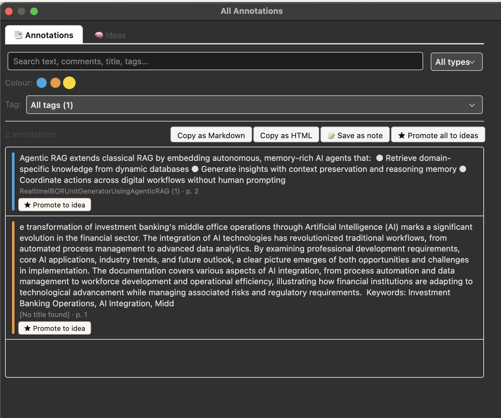
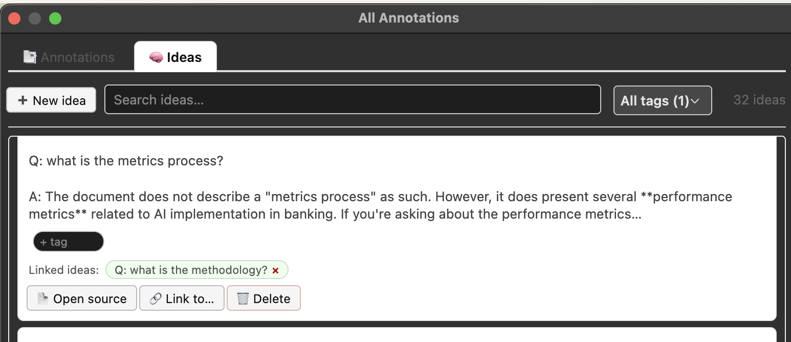

# Lattice for Zotero

[](https://www.zotero.org)
[](#-supported-providers--models)
[](LICENSE)
[](https://github.com/windingwind/zotero-plugin-template)

[English](README.md) | [Français](doc/README-frFR.md) | [简体中文](doc/README-zhCN.md)

**Lattice gets your annotations and ideas out of the per-paper silo.** See every highlight across your whole library in one place, filter and export them with citations, and promote the ones that matter into a searchable, taggable, cross-linked idea layer — all while staying linked to the source. It also includes grounded AI Q&A that answers from your PDFs with clickable page citations.

> The name: a _lattice_ is a network of connected nodes — which is exactly what your ideas become once they're no longer trapped in the single paper they came from.

> 📖 **New here? Start with the [Getting Started guide](doc/GETTING_STARTED.md)** — a 10-minute walkthrough of every feature.

---

## ✨ Features

### 🗂️ Cross-paper annotation browser

- **See all highlights in one place** — a single library-wide window listing every annotation, not one PDF at a time.
- **Filter** by **colour**, **tag**, **keyword**, and type — combined live.
- **Export the filtered set with citations** — copy as Markdown or HTML, or save as a standalone Zotero note. Each source is cited once (using your Zotero citation style) with its highlights beneath.
- **Jump to source** — click any annotation to open the PDF at that exact spot.



### 🧠 Citavi-style idea layer

- **Promote** any annotation into a first-class **idea** — a real Zotero note that's searchable and taggable on its own.
- **Tag ideas** in place, **link ideas to one another**, and **link back to the source** paper via Zotero relations.
- **Browse the layer** in its own tab — your thinking is reachable independently of the paper it came from, which is what breaks down past a few hundred sources.



### 💬 Grounded AI Q&A

- **Single-paper Q&A** from a side panel in the reader, and **multi-paper Q&A** across selected items.
- **Grounded, clickable citations** — `[Page N]` / `[Paper N, Page M]` jump straight to the cited page.
- **Save answers as annotations** so AI-surfaced insights flow into the annotation browser and idea layer.
- **Bring your own model** — Anthropic (Claude), OpenAI (GPT), Ollama (local), DeepSeek, Grok (xAI). Keys stay in Zotero's own preferences; run fully offline with Ollama.

---

## 🚀 Installation

1. Download the latest `lattice.xpi` from the [Releases page](https://github.com/birugit/zotero-grounded-qa/releases).
2. In Zotero, open **Tools → Plugins** (or **Add-ons**).
3. Click the gear icon ⚙ in the top-right → **Install Plugin From File…**
4. Select the downloaded `.xpi` file.
5. **Restart Zotero.**

> [!note]
> Requires **Zotero 7+**. For Q&A, each PDF's text must be indexed — open a PDF in the reader once, or right-click the item → **Reindex Item**. The annotation browser and idea layer work on your existing highlights and notes immediately.

---

## 💬 Usage

### Browse all annotations

1. **Tools → All Annotations.**
2. On the **📑 Annotations** tab: filter by the **colour** swatches, **tag** dropdown, type, and the **search** box.
3. Export with **Copy as Markdown / Copy as HTML / Save as note**, or click a row to open the source.
4. Click **★ Promote to idea** on a row (or **★ Promote all to ideas**) to send annotations into the idea layer.

### Work the idea layer

1. In the same window, switch to the **🧠 Ideas** tab (or **Tools → Idea Layer (Citavi)**).
2. **➕ New idea**, or work with promoted ones: add/remove tags inline, **📄 Open source**, **🔗 Link to…** another idea, **🗑 Delete**.
3. Ideas are ordinary Zotero notes tagged `★idea` — so they're fully searchable and taggable in Zotero itself and they sync.

### Ask grounded questions

- **Single paper:** open a PDF → **Grounded Q&A** section in the item pane → ask (Ctrl/⌘+Enter). Click `[Page N]` to jump; **📌 Save to annotations** to keep the answer.
- **Multiple papers:** select 2+ items → right-click → **"Q&A: Ask across selected papers."** Citations are `[Paper N, Page M]`; **📌 Save all to annotations** anchors the answer on each cited paper.

---

## 🔑 Configuration (Q&A only)

Open **Zotero → Settings (⌘,) → Lattice** in the left panel.

1. **AI Provider** — Anthropic, OpenAI, Ollama, DeepSeek, or Grok.
2. **API Key** — paste your key (not required for Ollama).
3. **Base URL** — shown for Ollama; defaults to `http://localhost:11434`.
4. **Model** — choose from the provider's model list.
5. **Test connection** — confirms provider, key, and model before you rely on them.

### Where to get an API key

| Provider       | Get a key                                                                    | Key format       |
| -------------- | ---------------------------------------------------------------------------- | ---------------- |
| **Anthropic**  | [console.anthropic.com](https://console.anthropic.com) → API Keys            | `sk-ant-api03-…` |
| **OpenAI**     | [platform.openai.com](https://platform.openai.com) → API Keys                | `sk-…`           |
| **DeepSeek**   | [platform.deepseek.com](https://platform.deepseek.com) → API Keys            | `sk-…`           |
| **Grok (xAI)** | [console.x.ai](https://console.x.ai) → API Keys                              | `xai-…`          |
| **Ollama**     | No key needed — [install Ollama](https://ollama.com) and run a model locally | —                |

---

## 🧩 Supported Providers & Models

| Provider               | Endpoint                    | Models                                                              |
| ---------------------- | --------------------------- | ------------------------------------------------------------------- |
| **Anthropic (Claude)** | `https://api.anthropic.com` | `claude-haiku-4-5-20251001`, `claude-sonnet-4-6`, `claude-opus-4-8` |
| **OpenAI (GPT)**       | `https://api.openai.com`    | `gpt-5.3-instant`, `gpt-5.4-pro`, `gpt-5.4-thinking`                |
| **Ollama (local)**     | `http://localhost:11434`    | `llama3.2`, `llama3.1`, `mistral`, `qwen2.5`, `gemma3`              |
| **DeepSeek**           | `https://api.deepseek.com`  | `deepseek-r1`                                                       |
| **Grok (xAI)**         | `https://api.x.ai`          | `grok-4.3`, `grok-4.20`                                             |

All cloud providers are called through their OpenAI-compatible `/v1/chat/completions` endpoint, except Anthropic, which uses its native `/v1/messages` API.

---

## 🗂️ How it works

- **Annotations** are read library-wide from Zotero's data model (each highlight is an `annotation` item under its PDF), indexed in memory, and kept fresh via Zotero's Notifier.
- **Ideas** are native standalone notes tagged `★idea`; links use Zotero's own item-relation system, so nothing lives in a private database.
- **Q&A** extracts per-page PDF text via `PDFWorker`, builds a context with `[Page N]` markers, asks your chosen provider to cite every claim, and turns the citations into clickable links. Answers can be saved as page-anchored note annotations.

---

## 🛠️ Development

Built on the [Zotero Plugin Template](https://github.com/windingwind/zotero-plugin-template) and [zotero-plugin-scaffold](https://github.com/northword/zotero-plugin-scaffold).

```bash
npm install        # install dependencies
npm run start      # dev Zotero with the plugin loaded + hot reload
npm run build      # production .xpi (output in .scaffold/build/)
npm run lint:fix   # lint / format
```

### Project layout

```
src/
  hooks.ts                       # Plugin lifecycle + menu registration
  modules/
    annotationIndex.ts           # Library-wide annotation index + Notifier
    annotationPanel.ts           # All Annotations window (Annotations + Ideas tabs)
    annotationExport.ts          # Markdown/HTML/note export with citations
    annotationWriter.ts          # Create page-anchored note annotations
    ideaLayer.ts                 # Citavi idea objects (notes + relations)
    ideaPanel.ts                 # Idea Layer browser UI
    qaPanel.ts                   # Reader Q&A panel + multi-paper dialog
    pdfExtractor.ts              # Per-page PDF text extraction
    llmClient.ts                 # Provider API calls + context building
    preferenceScript.ts          # Settings pane logic
```

---

## 🔍 Troubleshooting

**"No text found in this PDF."** Zotero hasn't indexed the PDF — open it in the reader once, or right-click → **Reindex Item**. Scanned PDFs without OCR have no extractable text.

**"API key not set."** Add your key in **Settings → Lattice**, then **Test connection**. (Not required for Ollama.)

**Q&A citations aren't clickable.** The model didn't emit the expected citation format; try a more capable model (Claude Sonnet/Opus, GPT-5.4 Pro), which follow the instructions more reliably.

**New colours/tags don't appear in the filter row.** Those rows are built when the window opens — close and reopen **All Annotations** to pick up newly added colours/tags.

---

## 📄 License

Distributed under the **AGPL-3.0-or-later** license. See [LICENSE](LICENSE).

No warranties are provided. You are responsible for any usage costs incurred with your chosen AI provider.
